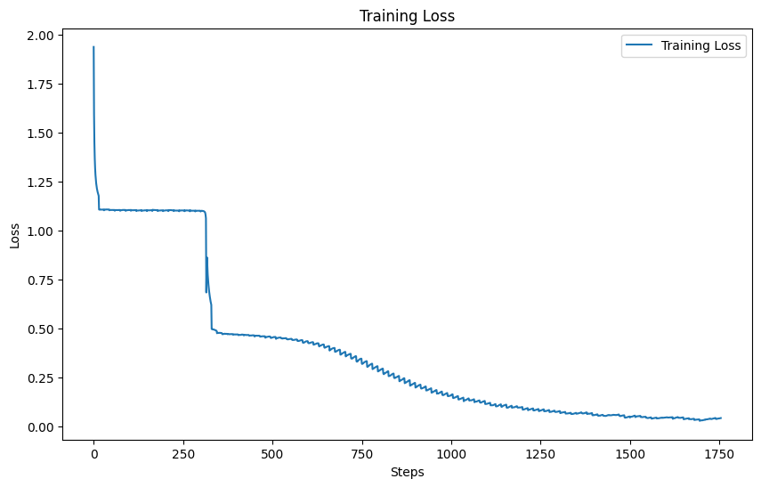
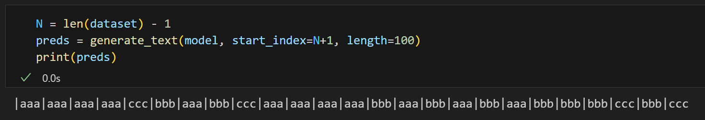
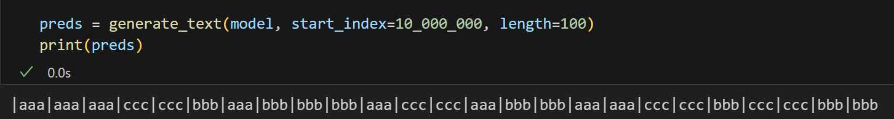
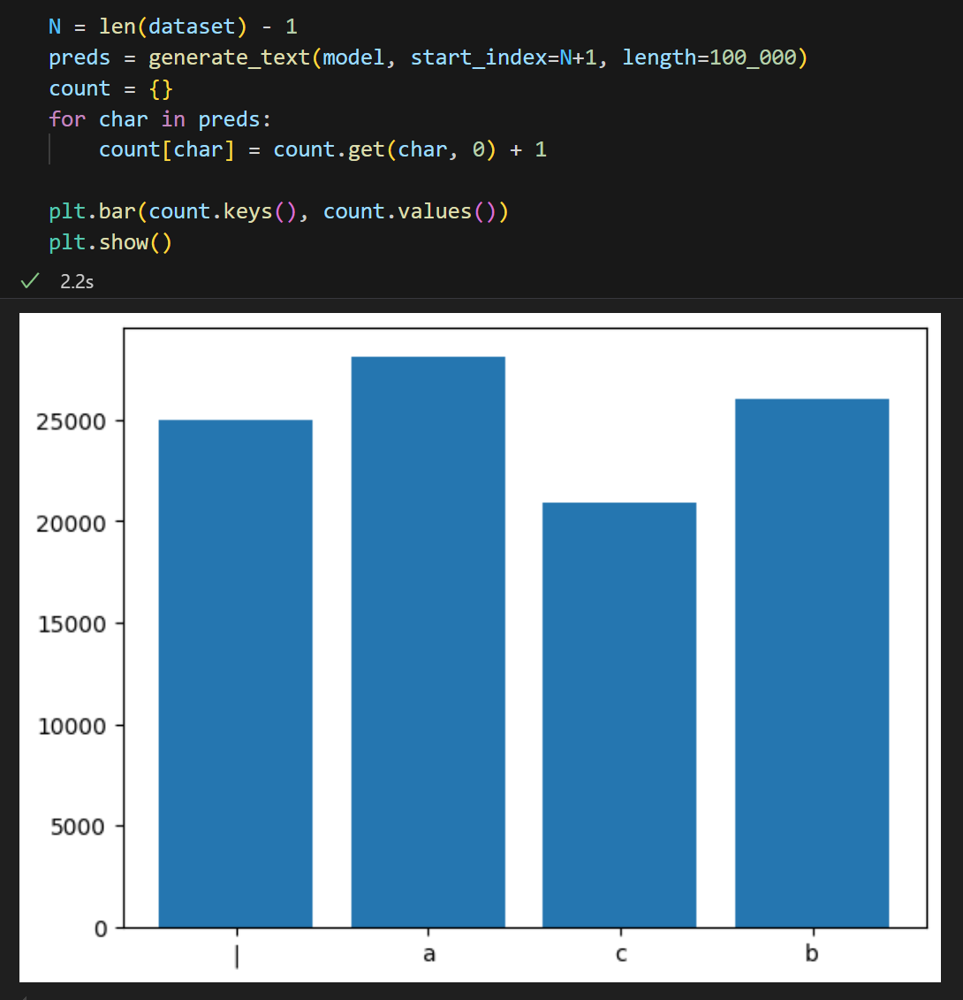
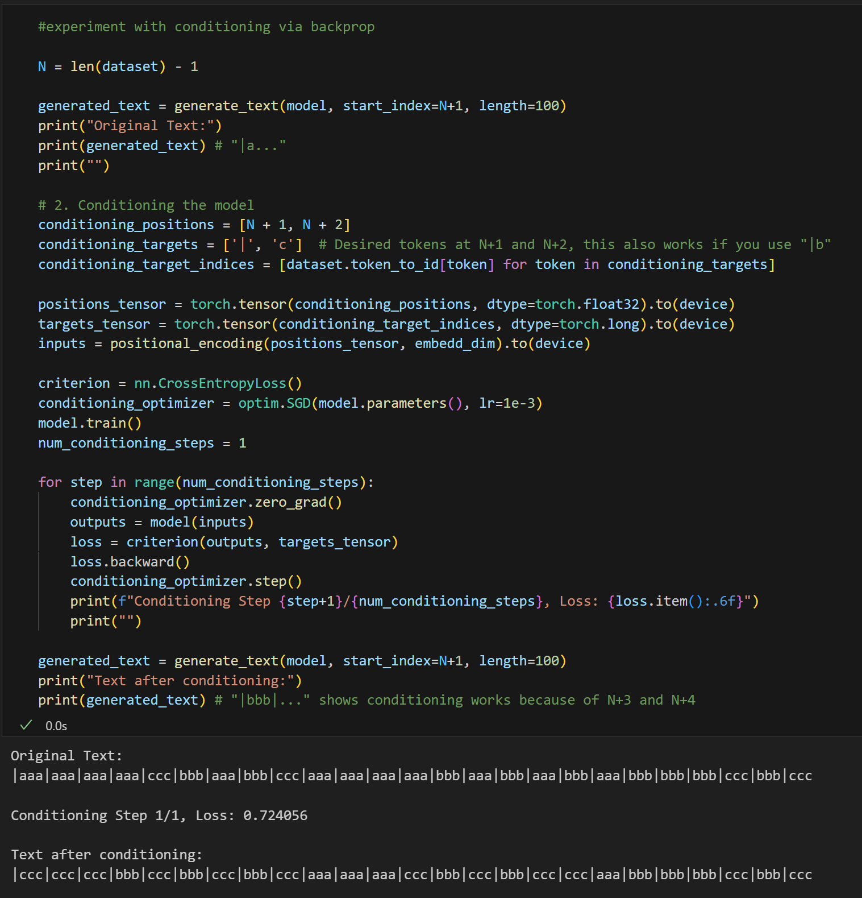
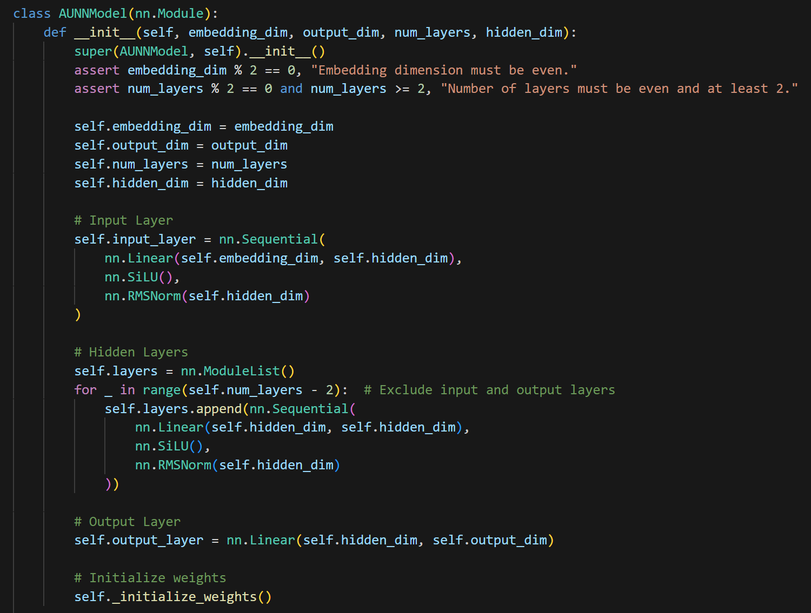

# Absolute Unit Neural Network (AUNN)

A simple implementation of Gwern's AUNN proposal:
https://gwern.net/aunn

---

# 2025-10-04

## Updates

Positive results! See writeup below. First some definitions: What is an AUNN? As I see it, the "spirit" of the proposal is:

1. Only use MLPs without any explicit mechanisms for sequence modeling.
2. Only use (embeddings of) positions, no tokens as input
3. The output of the network is solely the token at the given position.
4. Conditioning on a prompt happens via backpropogation
5. Autoregressive generation happens via backprop on the network's own outputs

I claim that the model within `experiments/09-mem_embeds/` fulfills all of the above criteria.

## Methodology

The primary trick I used was initializing the network from the weights of (a somewhat strange variant of) an RNN I first trained using backpropogation-through-time. As such I'll split this section into two parts: The RNN architecture and the AUNN architecture.

### Weird RNN (wRNN)

See `experiments/09-mem_embeds/model.py` for implementation. The chief difference between this RNN and a normal RNN is the following:

1. There is no layer-wise hidden state
2. The hidden state is purely captured via the input and output embeddings
3. The input hidden state is mapped to the output hidden state purely via sequential application of transformer-style MLP blocks
4. We update the hidden state by adding the embedding of the next token back to the output embedding. This becomes the input embedding for the next iteration
5. The model produces as output, at a given iteration, both the embedding of the next token as well as the same embedding that was given as input
6. We train with an auxiliarly MSE loss to encourage the current-state output embedding to be the same as the current-state input embedding

This is not a *good* architecture by any standard, but it does learn. The odd choices above are intentional and the rationale behind them should become clearer when seeing how they are used as part of the AUNN.

### AUNN

First the positional embeddings: In lieu of traditional sinusoid-based absolute positional embeddings, I use embeddings based on Random Fourier Features. I consider this choice somewhat arbitrary, but in testing I observe that the model learns & memorizes faster with RFF features, and they're an elegant way of encoding relative position information between two index values (the delta in index positions corresponds to a gaussian distributed cosine distance).

The entirety of the AUNN architecture is:
1. A linear layer to map the RFF embeddings into the model embedding dimension
2. A sequence of transformer-style MLP blocks called blocks_a
3. A sequence of transformer-style MLP blocks called blocks_b (indentical in structure to blocks_a)
4. RMSNorm on the output of the final block
5. Two projection heads: cur_proj & nxt_proj
6. Unembedding layer

You may notice that components 3-6 are identical to the components of the wRNN model. This is intentional. When we initialize our AUNN model, we directly copy all weights from a pretrained wRNN to the corresponding components in the AUNN, leaving components 1-2 randomly initialized.

When training the AUNN, components 1-2 form one parameter group (the "fast weights group") and components 3-6 form another group (the "slow weights group"). The fast weights group is trained with a much higher learning rate than the slow weights group.

One place where this implementation varies from the "pure" vision for an AUNN is the fact that it has two outputs per position, both "where we are" and "where we will be next". While this may seem redundant, it's actually very important for enabling autoregression via end-to-end backpropogation. The reason is that, if we only have one channel for output, in doing backprop on that output, the model has no way to disambiguate updates that are teaching it "what is here" versus "what kinds of things you should predict next". We want the next token prediction to encode within it a rich probability distribution of things that could be coming next, and backpropogating on this directly collapses that distribution, leading to a never ending stream of repeated tokens. If we instead do conditioning via purely backpropogating on the prediction for "what is here", we can teach the model the local context it belongs in without interfering with it's general next token prediction ability.

The above intuition also maps neatly onto the wRNN input / output embeddings. The input embedding of a wRNN is really just the "sharpened" version of the output next-token embedding from the last iteration, where we sharpen it by adding to the output the embedding of the actual next token. In this sense the output embedding encodes within it the space of possible next tokens and the input embedding encodes a commitment to one choice. This is exactly the characterists we want for the outputs of our AUNN.

So how do we actually train / inference this? The first thing we do is input the embedding of some index position. We'll get some output for the embeding of the current state (output of cur_proj) and the embedding of the next state (output of nxt_proj). Then, we'll calculate the MSE loss between the current state embedding and a target embedding. At the first position in the prompt, the target embedding is just the embedding associated with the first token of the prompt (We keep the embedding weights frozen while training. Also, I tried this via CE loss but MSE works much better in practice). At the same time, we will also calculate an auxiliary loss. This aux_loss is the MSE between the output of blocks_a and the current state embedding. This is essentially the same auxiliary loss we trained with during the wRNN pretraining. We sum these two losses together and then minimize end-to-end over all parameters via backprop. We do this minimization in a loop until the loss is below a threshold. Once that threshold is met, we inspect the next state embedding. Just like in the wRNN, we "sharpen the state" to commit to a choice by summing the next state embedding with the embedding of the next token in the prompt. This sum then becomes the target that we want the current state embedding of the next position to approximate (which we do so by another round of MSE minimization with respect to that target). This continues until we run out of tokens in the prompt. At this point, we can autoregressively generate via the same procedure as before, but instead of getting the next token from the prompt to sharpen the next state embedding with, we take the argmax of the logits of the next state embedding, calculate the embedding of that argmax token, and add that token embedding back to the next state embedding to form the target for the next round.

## Results

This works! See below for an example generation for an AUNN model trained on the SimpleStories dataset.

```
root@1748d37fe79e:/workspace/AUNN/experiments/09-mem_embeds python train.py --resume
Number of parameters: 23084032
Loading checkpoint from /workspace/AUNN/experiments/09-mem_embeds/checkpoints/20251005_002634.bin
Number of parameters: 44068864
[prompt] next_token: one
[prompt] next_token: day
[prompt] next_token: a
[prompt] next_token: girl
[prompt] next_token: named
[gen] next_token: lily
[gen] next_token: found
[gen] next_token: a
[gen] next_token: strange
[gen] next_token: map
[gen] next_token: in
[gen] next_token: her
[gen] next_token: backyard
[gen] next_token: .
[gen] next_token: she
[gen] next_token: had
[EOS] one day a girl named lily found a strange map in her backyard. she had
```

## Reflection

Thinking about the final result here, I'm skeptical that it's useful in a practical sense. I mostly completed this project to prove to myself that it really was possible to have a system that complied with the 5 criteria I outlined above, which I think I've done. 

One might rightly ask if there is any real advantage over using the AUNN versus just inferencing the original wRNN model. To this I'd answer, no probably not, I suspect it's roughly equivalent to directly inferencing the wRNN model while using dynamic evaluation, in which case it would probably be significantly faster to just do that.

Was it cheating to initialize off of the wRNN weights? Maybe yes, maybe no. My intention was just to fullfil the very literal description of what an AUNN is, for which the wRNN initialization was useful. I do not know how to get equivalent behavior when pretraining from scratch. However there is some sense in which this instantiation of an AUNN isn't entirely faithful to the original proposal. I feel that part of the intent was to propose a system that could treat model parameters as hidden state, and correspondingly unlock the performance advantages of a form of hidden state that's much more expressive than a normal RNN's activation based hidden state. I feel that there's a subtle difference between "model weights as state" versus "model weights that memorize the activations corresponding to a state". The second is closer to what I've done.

What would a more faithful implementation look like? I'm not sure, though I do have some vague ideas. Inside of `09-mem_embeds/toy_example` I played with one idea for what this might look like. Architecturally it's quite similar to what I have implemented above for the AUNN. The primary difference is in the training procedure. It's both trained from scratch and trained with an unusual auxiliary loss which I've called "causal_loss". This causal_loss enforces that predictions from the next state output are consistent with the preditions of the current state output at the next position. This seems to dramatically change training dynamics is such a way that, at least within the toy example, I saw "true" generalization of the pattern in the dataset purely based on the relationship between positional embeddings, even before trying to do any kind of backpropogation based conditioning. This tells me that the model has some genuine notion of directionality based on the positional embedding and an understanding of how the dataset evolves as a function of that direction. I have no idea how to scale this but it would be interesting if someone did. As for myself, I'll probably mark this project as complete for now, save for potentially a more formal writeup of these current results.

Overall the project was deeply interesting and taught me a great deal. I appreciate that it required me to challenge a lot of my prebuilt ML conceptions. I do think this general idea of metalearning and continual learning via backpropagation during test time is very promising. I have some other ideas as to what that might look like (keep an eye on the repo `METALEARN` for any developments there).

---

# 2024-11-22

## Background

First assign every token in a dataset a sequential index. Then, train a model to predict those tokens using nothing but the index. This is similar in concept to NeRFs, where the network is explicitly acting as a compressed representation of the dataset. The hope with AUNNs is that you could inference the network on unseen indices (i.e if the dataset is N tokens long, see what the prediction is for N+1) and that model would generalize well enought that the "next-index" prediction continues the sequence in a coherent way. You could imagine doing language modeling by training on one really long string of text (from The Pile, Wikipedia, etc), and asking the model what values are associated with the indices after the dataset ends.

In the proposal there's also the idea of "prompting" the model via conditioning-by-backpropogation. Essentially, you train the model via backprop that the "true" values for indices N+1, N+2, ..., N+P (where P is the length of your prompt) equates to the text of your prompt. You'd then see a logically coherent continuation of your prompt as the prediction for the post-prompt indices. At scale, this gets you behavior very similar to the "in-context-learning" you see in transformer or RNN models (or at least that's the hope).

I suggest Gwern's original article for more details. The architecture is very simple but the approach is a bit odd. Evidence of it working at all would be neat.

## Results

Intrigued by Gwern's proposal, I spent a few hours this week creating a simple implementation. With a toy dataset, there's some evidence both of generalization to unseen indices and of the ability to use backprop to "condition" on input for sequence-prediction tasks. The dataset has the following format:

`|bbb|aaa|aaa|aaa|aaa|ccc|ccc|bbb|aaa|bbb|ccc|bbb|bbb|bbb|aaa|bbb|ccc|....`

Every three-letter chunk is chosen randomly. In total I train on 100k randomly chosen sequences (aka 400k characters) for 500 epochs:



Once training is complete we reach 100% accuracy on the training set i.e. we've completely memorized the training set. Then we can query the model to get the predictions for N+1, N+2, ... , where N is the length of the dataset (400k chars) less one (for zero indexing). Doing this we get the following:



Although the model has never trained on indices > N, the model still generalizes to these unseen indices, in the sense that it preserves the local structure expected of the pattern ("|" every 4 chars, letters always come in sets of 3). It also generalizes to very to large input indices (greater than 10 million):



The value of a particular sequence in the training set is random, but the model still (very roughly) learns an even distribution of characters. I've made a histogram of all character predictions from N to N + 100k to illustrate the point:



I also try to demonstrate conditioning model outputs via a single step of backprop:



Here the original predictions for N+1 to N + 4 are `|aaa`.

I train the model with the values of `|c` for N+1 to N+2. 

Then, we see that N+3 to N+4 switch to `cc` in the post-conditioning output.

This shows (in a toy example at least) that the model can incorporate information provided within a single step of backprop while also utilizing the "knowledge" instilled in the model weights during pre-training. In this case the knowledge is the pattern that all letters must appear in triplets.

I found this little experiment interesting. Given more compute, maybe it could work for more complex language modeling tasks? 

Implementation-wise I'm just using a bog-standard MLP, with the Swish activation function, RMSNorm, and skip connections every 2 layers. The MLP has a hidden dimension of 64 and uses 8 layers. Much credit goes to GPT-o1 for helping me prototype. For the position embedding I'm using binary inputs (each dimension is a different digit of a 64 bit binary number). I also tried more standard fourier embeddings (as you might seen in LLM's) but surprisingly those seemed less performant, at least in the few tests I did. Though I doubt that holds true when modeling more complicated distributions.



The current version of this in the notebook includes some optimizations & misc changes I made after typing this original experiments/01-sequence/writeup. 

Of course, the biggest question is does this still work with non-trivial datasets? I'm planning a few follow-ups to see if it does. The simplest next step would be MNIST classification, and given that works I'll probably look into language modeling via TinyShakespeare.
