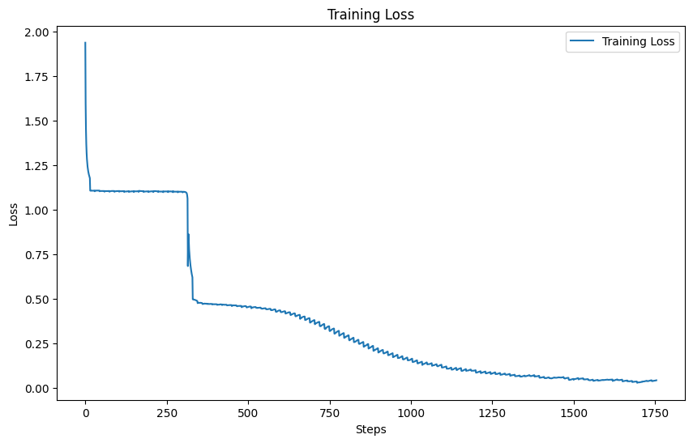
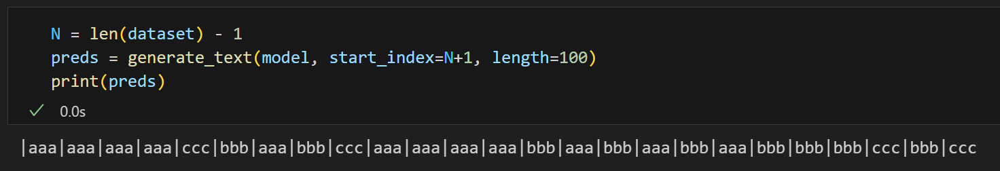
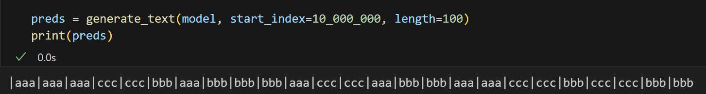
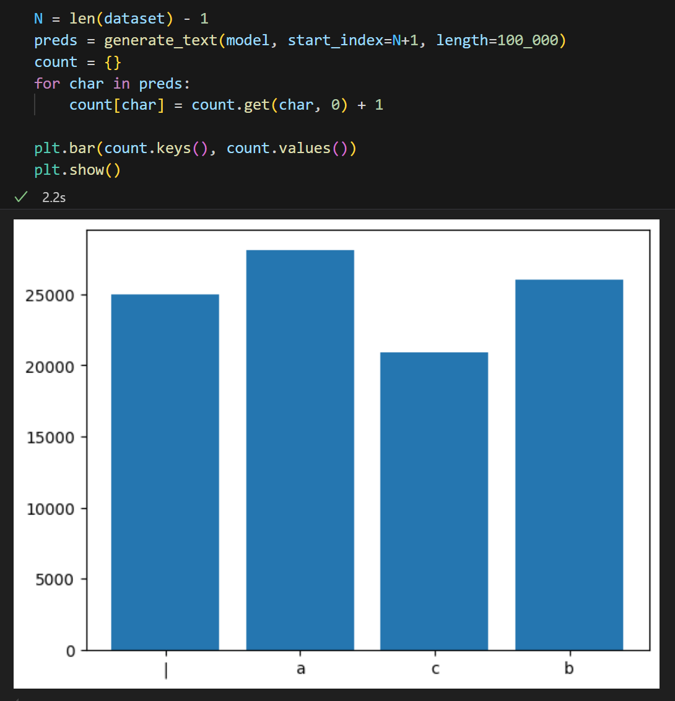
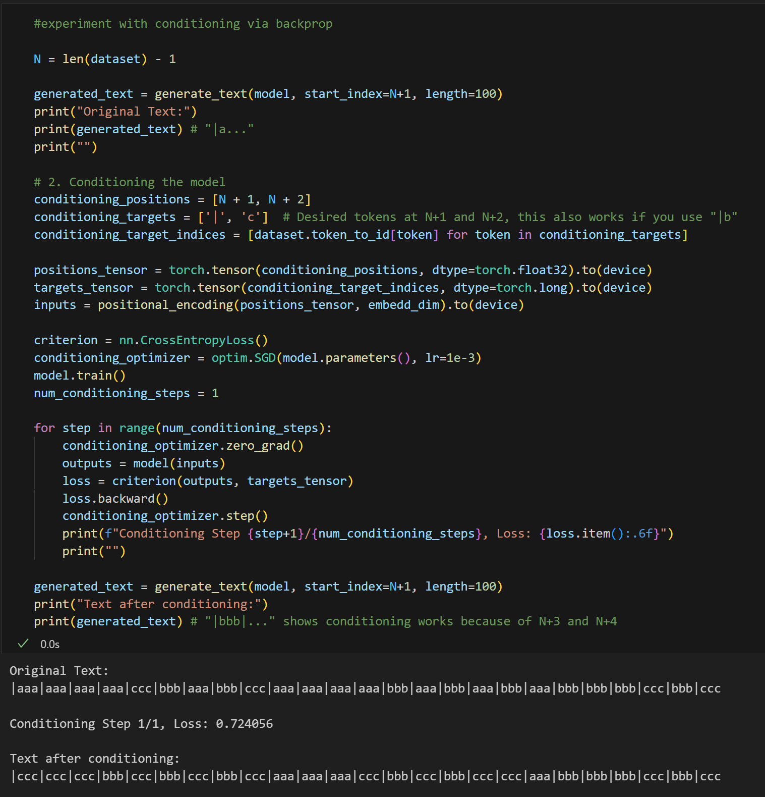
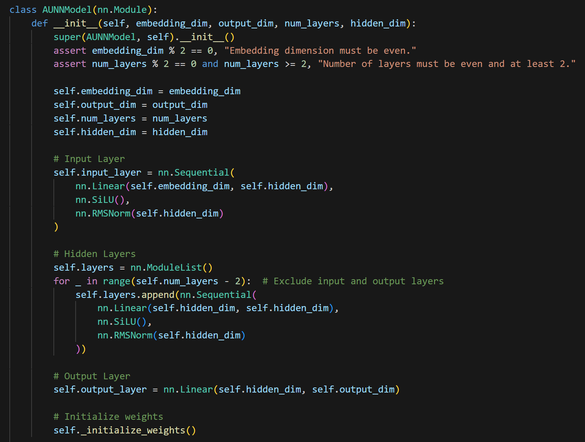

# Absolute Unit Neural Network (AUNN)

A simple implementation of Gwern's AUNN proposal:
https://gwern.net/aunn

## Background

The basic idea is you assign every token in a dataset a sequential index and train a model to predict a token using nothing but the index as input. This is very similar in concept to NeRFs, where the network is acting as a compressed representation of the dataset. The hope with AUNNs is that you could then inference the network on unseen indices (i.e if the dataset is N tokens long, see what the prediction is for N+1) and that "next-index" prediction would continue the sequence in a coherent way. You could imagine doing language modeling by having one really long string of all the text on the internet, and asking the model what values are associated with the indices after the dataset ends. 

In the proposal there's also the idea of "prompting" the model via conditioning-by-backpropogation. Essentially, you train the model via backprop that the "true" values for indices N+1, N+2, etc (or however long your prompt is) equates to the text of your prompt. Then you'd see a logically coherent extrapolation of your prompt for the prediction of the post-prompt indices. This gets you behavior very similar to the "in-context-learning" you see in transformer or RNN models (or at least that's the hope).

I'll direct readers to the original article for more details. Overall the model architecture is both extremely simple while also being extremely different from normal approaches to sequence modeling. Having any evidence of it working at all would be very interesting.

## Results

Intrigued by Gwern's proposal, I spend a few hours this week creating a simple implementation. The results are interesting. With a toy dataset, I see evidence both of generalization to unseen indices and of the ability to use backprop to "condition" on input for sequence-prediction tasks. The dataset has the following format:

`|bbb|aaa|aaa|aaa|aaa|ccc|ccc|bbb|aaa|bbb|ccc|bbb|bbb|bbb|aaa|bbb|ccc|....`

Every three-letter chunk is chosen randomly. In total I train on 100k randomly chosen sequences (aka 400k characters) for 500 epochs:

Once training is complete we reach 100% accuracy on the training set i.e. we've completely memorized the training set. Then we can query the model to get the predictions for N+1, N+2, ... , where N is the length of the dataset (400k chars) less one (for zero indexing). Doing this we get the following:

Although the model has never trained on indices > N, the model still generalizes to these unseen indices, in the sense that it preserves the local structure expected of the pattern ("|" every 4 chars, letters always come in sets of 3). It also generalizes to very out-of-distribution input indices (such as 10 million):

The value of a particular sequence in the training set is random, but the model still (very roughly) learns an even distribution of characters. I've made a histogram of all characters predictions from N to N + 100k to illustrate the point:

I also attempt to demonstrate conditioning the model outputs via a single step of backprop:

Here the original predictions for N+1 to N + 4 are `|aaa`.

I train the model with the values of `|c` for N+1 to N+2. 

Then, we see that N+3 to N+4 switch to `cc` in the post-conditioning output.

This shows (in this toy example at least) that the model can incorporate information provided within a single step of backprop while also utilizing the "knowledge" instilled in the model weights during pre-training. In this case the knowledge is the pattern that all letters must appear in triplets.

I found this small experiment very interesting. I don't see any immediate reason why (given sufficient compute) this wouldn't work for more complex language modeling tasks. 

Implementation-wise I'm just using a bog-standard MLP, with the Swish activation function, RMSNorm, and skip connections every 2 layers. The MLP has a hidden dimension of 64 and uses 8 layers. Much credit goes to GPT-o1 for helping me prototype. For the position embedding I'm using binary inputs (each dimension is a different digit of a 64 bit binary number). I also tried more standard fourier embeddings (as you might seen in an LLM's input) but surprisingly those seemed less performant, at least in the few tests I did.

Time permitting, I'll likely do a few follow-ups to this toy example. I've had one suggestion to try language modeling with the Tiny-Shakespeare dataset, which seems like a interesting next step.